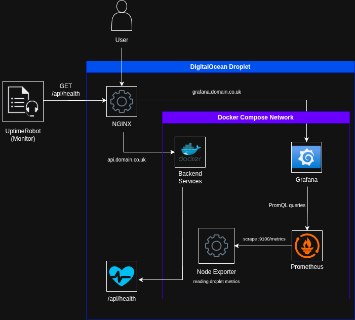

# Maths Exam Builder

A lightweight exam-building tool designed for tutors and teachers to generate GCSE-style maths exams. Select from a curated question bank and generate clean, printable PDFs using LaTeX formatting.

This project was born out of a real need I experienced as a maths tutor — I often wanted to create structured, exam-style papers for my students but couldn’t find a tool that was simple, fast, and free-to-use. So I built one. Now, I can generate tailored practice exams for my students in just a few clicks and I hope to scale it so teachers and educators across the UK can use it too.

---

# Exam Builder – Observability + Deployment Case Study

🚀 Overview

I revived an older project of mine, a LaTeX-based exam builder, and used it as a playground for learning real DevOps fundamentals: observability, Docker-based architecture, CI/CD, Linux troubleshooting, and production deployment.

This project now includes:

- Node backend with /health endpoint

- Docker Compose architecture

- CI/CD for SSH deployment with DockerHub

- Observability stack: Node Exporter, Prometheus, Grafana

- UptimeRobot external monitoring

- Nginx reverse proxy + SSL

- Automated deployments with a custom deploy.sh

---

### 🔧 Architecture Diagram (new version)

Components:

- User

- Nginx reverse proxy

  - Serves backend API

  - Routes grafana.tacknowledge.co.uk to Grafana container

  - Handles SSL termination

- Backend container (Node)

  - Exposes /api/health

  - Prometheus-ready

- Node Exporter container

  - System metrics

- Prometheus container

  - Scrapes Node Exporter

  - Provides metrics to Grafana

- Grafana container

  - Dashboards + alerts

- DigitalOcean Droplet

  - All containers running via Docker Compose

  - Volumes persist Grafana + Prometheus data



### ⚙️ Deployment Flow

1. Push to GitHub

2. GitHub Actions SSH into droplet with `main.yml`

3. Run `deploy.sh`

4. Script pulls new backend image from Docker Hub, restarts entire stack using:

```
docker-compose up -d
```

5. Observability stack stays running, with dashboards kept inside Docker volumes.

### 📊 Observability Features

- Node Exporter

  - CPU, RAM, Disk, Network, Load

- Prometheus

  - Scrapes metrics every 15s

- Grafana

  - Imported "Node Exporter Full (ID: 1860)" dashboard

  - Custom CPU Usage panel

  - SSL-secured grafana.tacknowledge.co.uk

- UptimeRobot

  - Monitors /api/health

  - External uptime verification
